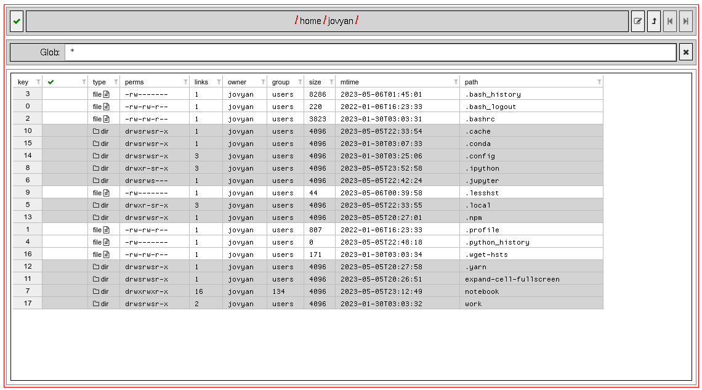

This notebook implements a Jupyter directory browser widget using [ipydatagrid](https://github.com/bloomberg/ipydatagrid):

Read the detailed documentation in the [html export](https://mister-average.github.io/directory_browser_using_ipydatagrid/directory_browser_using_ipydatagrid.html) of the notebook.
